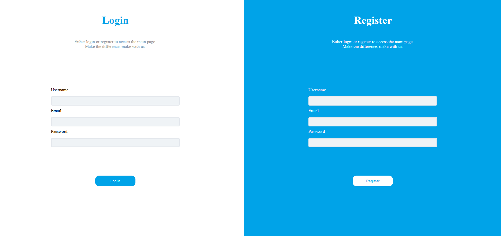

# Register and Login

O **Register and Login** é um projeto Node.js criado para prática de autenticação de usuários, registro, login e proteção de rotas utilizando banco de dados NoSQL (MongoDB). O objetivo é fornecer uma base simples e funcional para sistemas que precisam de controle de acesso.


## Funcionalidades

* Cadastro de usuários com nome, email e senha protegida
* Login seguro com autenticação usando JWT e hash de senhas com bcrypt
* Upload de arquivos com multer e cloudinary
* Proteção de rotas: apenas usuários autenticados acessam páginas restritas
* Templates dinâmicos com EJS
* Configuração por variáveis de ambiente via dotenv

## Tecnologias Utilizadas

* JavaScript
* Express.js
* MongoDB e Mongoose
* EJS (engine de visualização)
* JWT (jsonwebtoken)
* bcrypt
* dotenv
* multer e cloudinary (funcionalidade incompleta)
* cookie-parser
* nodemon

## Como executar

1. Clone o repositório:
   ```bash
   git clone https://github.com/devRafaelFagundes/register-and-login.git
   ```

2. Acesse o diretório:
   ```bash
   cd register-and-login
   ```

3. Instale as dependências:
   ```bash
   npm install
   ```

4. Configure o arquivo `.env`:
   ```
   MONGODB_URI=sua_string_de_conexao_mongodb
   JWT_SECRET=sua_chave_secreta
   CLOUDINARY_CLOUD_NAME=seu_cloud_name
   CLOUDINARY_API_KEY=sua_api_key
   CLOUDINARY_API_SECRET=sua_api_secret
   ```

5. Inicie o servidor:
   ```bash
   npm run dev
   ```
   ou
   ```bash
   npm start
   ```

6. No navegador, acesse:
   ```
   http://localhost:3000
   ```

## Estrutura do Projeto

* `server.js`: Arquivo principal do servidor
* `models/`: Schemas do Mongoose
* `routes/`: Rotas da aplicação
* `views/`: Templates EJS
* `public/`: Arquivos estáticos (CSS, imagens, etc.)

## Contribuição

Sugestões, melhorias, reportes de bugs ou novas funcionalidades são bem-vindos!  
Para contribuir:

1. Faça um fork do projeto
2. Crie uma branch:
   ```bash
   git checkout -b minha-feature
   ```
3. Faça suas alterações e commits
4. Envie para o seu fork:
   ```bash
   git push origin minha-feature
   ```
5. Abra um Pull Request neste repositório

## Licença

Projeto sem licença específica — fique à vontade para usar e modificar.

---

Projeto desenvolvido para aprendizado e como base para autenticação em Node.js. 🚀
